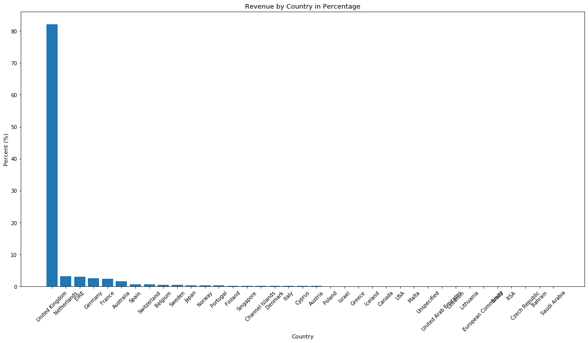
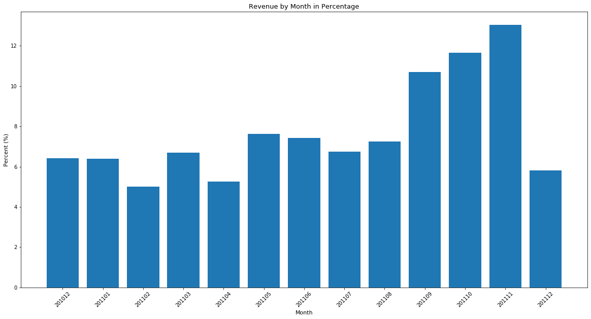
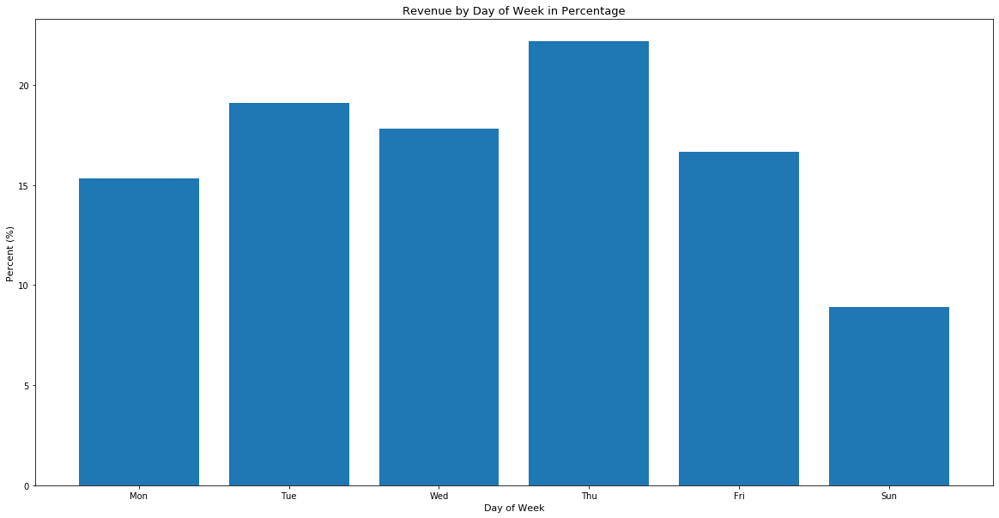
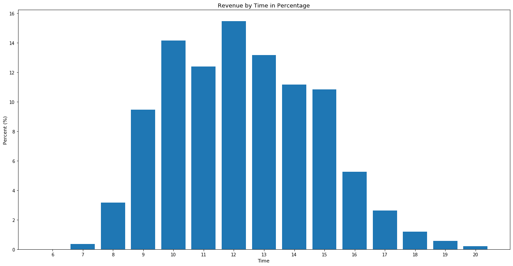
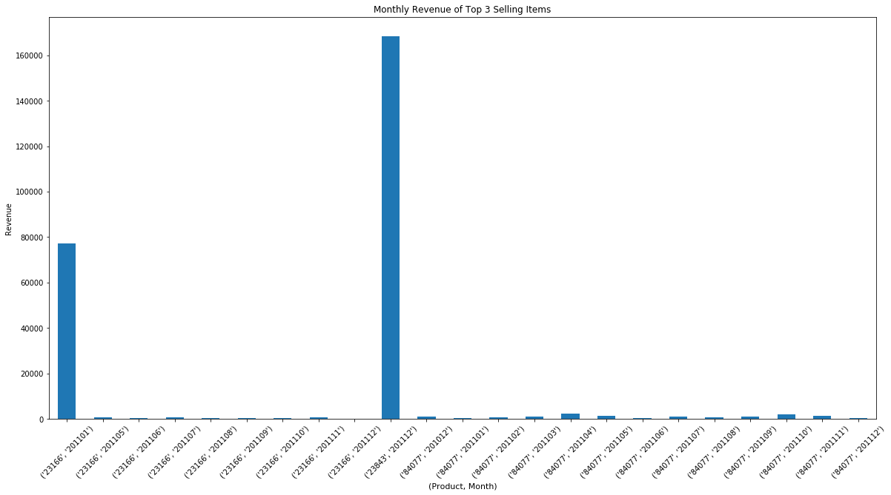
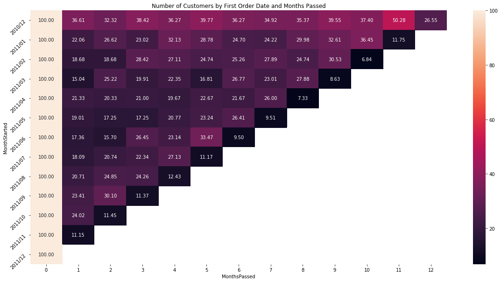
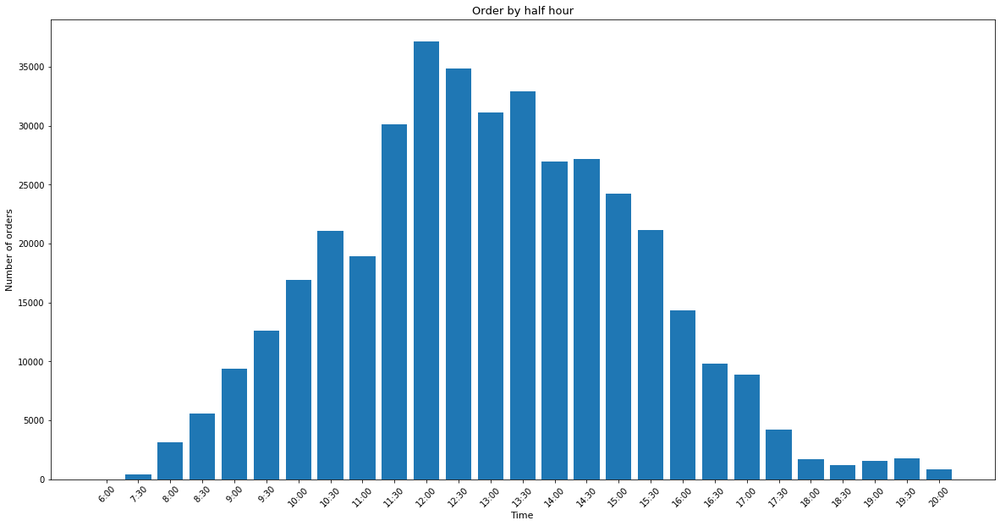
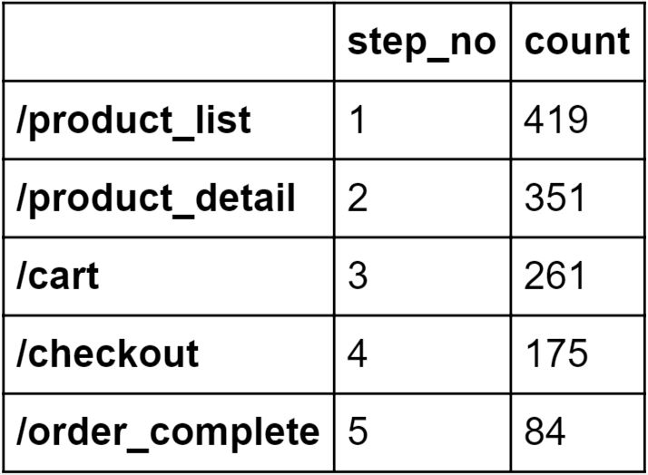
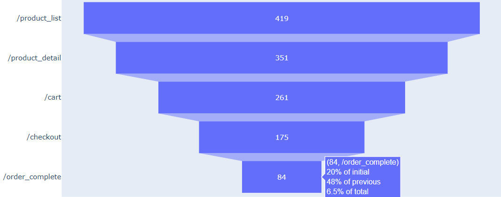

# Online Mall Order Data Analysis

+ This project was conducted by Young Sim

+ **Keywords: Data Analysis, Data Visualization, Bar Charts, Heatmaps, Funnel Charts, Python**

+ **Objectives**: The goal of this project is to find insights from online mall order data to identify possible areas of improvements in terms of sales and make decisions.

+ **Summary**: This project analyzes online mall order data with the goal of finding insights to help maximize sales and revenues. See project notebooks for more details.
  + Revenue data
  
  First, I looked into revenue data to see revenue by different regions and time frames.
  
  
  
  Most of the revenue is coming from the UK.
  
  
  
  September through November 2011 showed the highest revenue. See what events happened in this period that might have caused increase in revenue (sale, advertisement, etc.).
  
  
  
  Thursdays had the highest revenue in the week.
  
  
  
  Highest revenue was earned around noon.
  
  Next, I found out top 10 selling and top 10 revenue generating items. Then I created the below bar chart, which shows revenue from top 3 selling items by month. Item 23166 in January 2011 and Item 23843 in December 2011 had significantly large revenue.
  
  
  
  + Customer Data
  
  In order to identify which customers are loyal and are worth extra care or promotions I listed customer by number of orders and by total payment. Next, to analyze customer retention, I created a heatmap that shows number of customers by date of first purchase and months passed since the first order.
  
  
  
  Many of the customers who first made purchase in December 2010 made an order 11 months later. It is worth discussing what might have been the cause or motivation.
  
  + Push Notification Time Decision
  
  Next, I analyzed order times to decide when is the good time to send push notifications for promotions.
  
  
  
  Around noon is when the largest number orders are made, so may be the best time. However, it would be better to send personalized notifications based on the most used time for each customer. We can group customers by the time they placed most orders. For example, customers with ID 73, 269, 319, 344, 375, 893, 1667, and 2317 make orders at 7 the most.
  
  + Log data
  
  Finally, I analyzed web log data to learn about customer retention.	In order to find out where the customers are lost the most, I conducted a funnel analysis with log data. Below is the interactive funnel created. 
  
  
  
  
  
  74% of customers who see product detail page proceed to their carts. 67% of customers who reached their carts proceed to checkout. Only 48% of customers who reach checkout page complete their orders. See what might be causing customers to leave (e.g. too much to fill in order form). Customers are spending 16 to 18 minutes in each step on average. We might want to consider more intuitive design/layout and simplify actions needed in each step (especially checkout section where we're losing the most customers) to shorten the amount of time customers spend in each step.
  
  
+ **Contributions**
  + Preprocessed and analyzed revenue and customer data in Python in order to find insights such as revenue by different regions and time frames, top-selling items, customer loyalty, and customer retention.
  + Interpreted when maximum number of orders were placed by each customer to decide when to send personalized notifications.
  + Analyzed and visualized web server log data to see where customers are lost and what may be possible reasons for losses.

Following [suggestions](http://nicercode.github.io/blog/2013-04-05-projects/) by [RICH FITZJOHN](http://nicercode.github.io/about/#Team) (@richfitz). This folder is orgarnized as follows.

```
proj/
├── data/ data used in analytics
├── doc/ final deliverable notebooks
├── figs/ figures
├── lib/ preprocessing
└── output/ processed datasets
```

Please see each subfolder for a README file.

